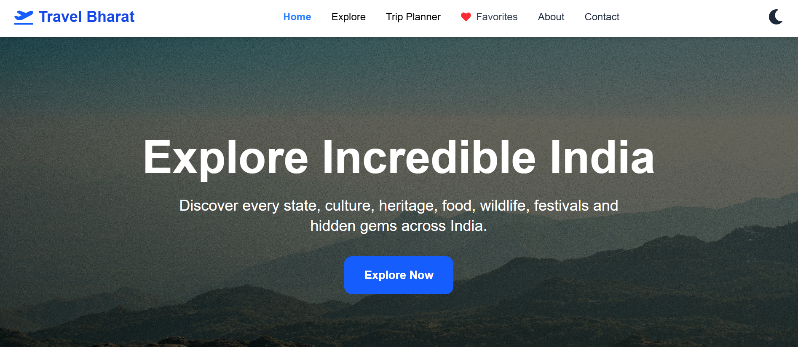
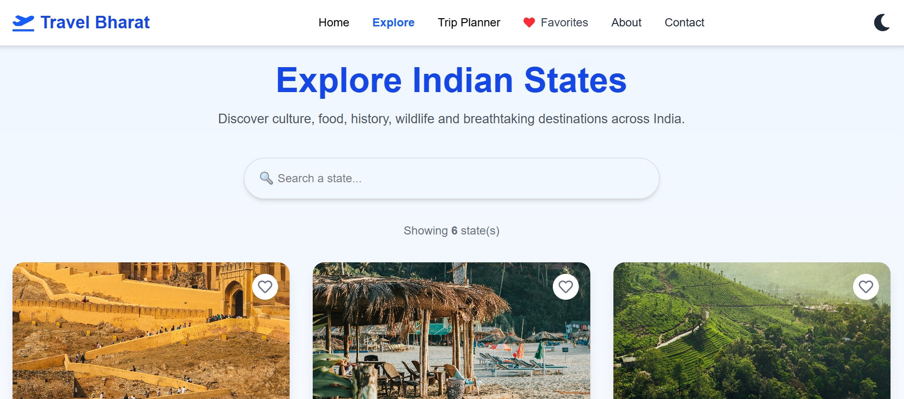
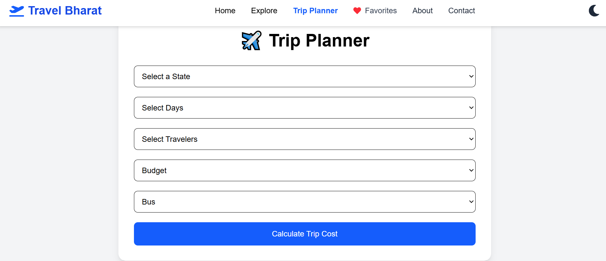
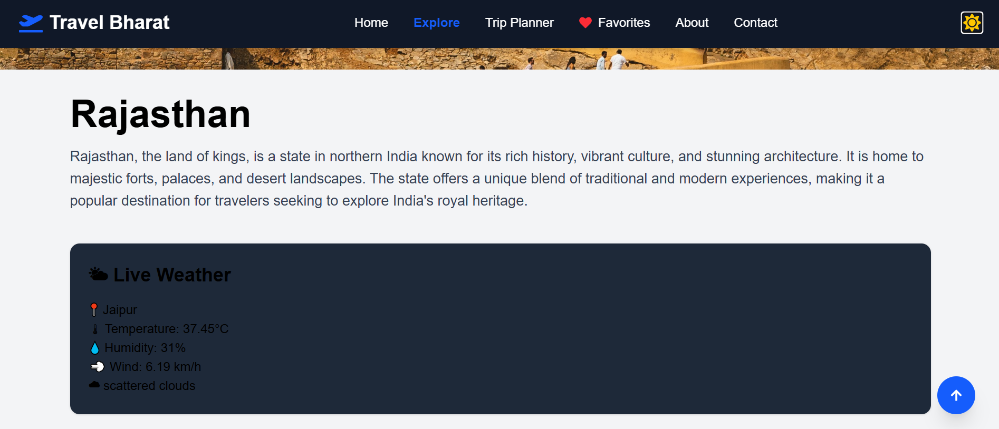

# 🇮🇳 Travel Bharat

A modern and responsive travel website built using React, Vite and Tailwind CSS to help users explore India's states, famous destinations, live weather, maps and trip planning.

## 🌐 Live Demo

**Website:** https://travel-bharat-beta.vercel.app/

## ✨ Features

- 🏞️ Explore all Indian states
- 📍 Detailed information for every state
- 🖼️ Interactive image gallery with Lightbox
- 🌦️ Live Weather using OpenWeather API
- 🗺️ Google Maps integration
- ❤️ Favorite states
- 🧳 Trip Planner
- 🌙 Dark Mode
- 🔍 Search functionality
- 📱 Fully Responsive Design
- ⚡ Smooth animations with Framer Motion

---

## 🛠️ Tech Stack

- ⚛️ React.js
- ⚡ Vite
- 🎨 Tailwind CSS
- 🧭 React Router DOM
- 🎬 Framer Motion
- 🌦️ OpenWeather API
- 🗺️ Google Maps
- 🎯 React Icons
- ☁️ Vercel (Deployment)
- 🐙 GitHub (Version Control)

## 📸 Screenshots

### 🏠 Home Page


### 🗺️ Explore Page


### 🧳 Trip Planner


### 🌦️ Weather


### 🌙 Dark Mode


---

## 🚀 Installation

Clone the repository

```bash
git clone https://github.com/Parag1118/travel-bharat.git
```

Go to the project folder

```bash
cd travel-bharat
```

Install dependencies

```bash
npm install
```

Start the development server

```bash
npm run dev
```

---

## 👨‍💻 Developer

**Parag**

Frontend Developer | React Developer

---

## 📬 Contact

- GitHub: https://github.com/Parag1118
- Live Demo: https://travel-bharat-beta.vercel.app/

---

## 🚀 Future Improvements

- 🔐 User Authentication (Firebase)
- 🤖 AI Travel Assistant
- ☁️ Cloud Sync for Favorites
- 📅 Hotel & Flight Booking
- 🌍 Multi-language Support
- 📱 Progressive Web App (PWA)

---

## 📄 License

This project is created for educational and portfolio purposes.

---

## ⭐ Support

If you like this project, please consider giving it a ⭐ on GitHub.


